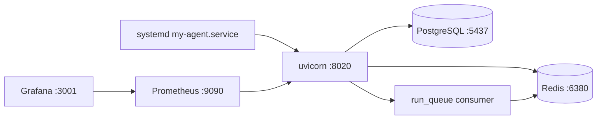

# CEO Audit — Production Readiness (v3.4)

**Date:** 2026-05-26  
**Version:** my-agent v3.4.0  
**Audience:** CTO / Ops / Due diligence  
**Prior audits:** v3.3.0 (sales), v3.3.1 (product depth)

---

## Executive Verdict

v3.3.1 delivered product features on a **fragile ops foundation**. v3.4 closes the gap between "works on my laptop" and **survives prod restarts**:

| Before v3.4 | After v3.4 |
|-------------|------------|
| Manual `nohup uvicorn` | `systemd my-agent.service` + auto-restart |
| `redis: false` on VDS | `REDIS_URL` required in production |
| SQLite fallback in prod | Fail-fast PostgreSQL only |
| `asyncio.create_task` runs lost on restart | Redis durable queue (RPOPLPUSH) |
| No backups | Daily `pg_dump` cron |
| Monitoring profile unused | Prometheus + Grafana + alert rules |

**CEO question:** "Что сломается при рестарте сервера?"  
**CTO answer (post-v3.4):** API поднимается через systemd; Redis/Postgres через compose; orphaned runs помечаются failed; queued runs восстанавливаются из processing list.

---

## Verified Metrics (2026-05-26)

| Metric | Value |
|--------|------:|
| Version | 3.4.0 |
| pytest modules | 48+ |
| Production DB | PostgreSQL (`DATABASE_URL` required) |
| Redis | Required when `ENV=production` |
| Workflow run durability | Redis queue `workflow:runs:pending` |
| Monitoring | `--profile monitoring` (Prometheus :9090, Grafana :3001) |
| Backup retention | 14 days (`/opt/backups/my-agent/`) |

---

## Architecture (prod)



---

## Deploy Checklist (VDS)

1. `vds-push` + sync work tree
2. `.env`: `ENV=production`, `DATABASE_URL`, `REDIS_URL`
3. `docker compose up -d db redis`
4. `alembic upgrade head` + optional `scripts/migrate_sqlite_to_postgres.py`
5. `cp deploy/my-agent.service /etc/systemd/system/` → `systemctl enable --now my-agent`
6. `docker compose --profile monitoring up -d`
7. Cron: `deploy/scripts/backup-db.sh` daily at 03:00
8. Verify: `curl /api/health` → `"redis": true`

---

## Remaining Gaps (v3.5+)

| Gap | Priority | Notes |
|-----|----------|-------|
| Stripe billing | P0 revenue | Plan limits exist; no checkout |
| Worker service split | P2 | Scheduler still in API process |
| External uptime check | P2 | UptimeRobot on `/api/health` |
| Full isolation audit | P2 | Extend tests beyond workflow runs |
| HubSpot/Airtable | P3 | See AUDIT_PRODUCT_2026.md |

---

## Test Commands

```bash
docker compose up -d --build agent
docker compose exec -T agent python -m pytest tests/test_production_v34.py tests/test_workflow_engine.py -q
curl -s http://127.0.0.1:8020/api/health | python3 -m json.tool
```

---

*Generated as CEO Audit v3.4 — Production Readiness.*
