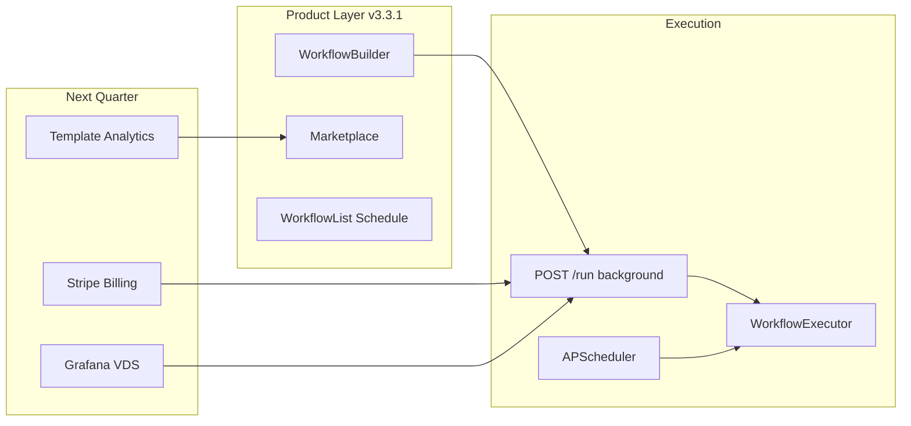

# CEO Audit — Product Depth & New Features

**Date:** 2026-05-26  
**Version:** my-agent v3.3.1  
**Audience:** CTO / Engineering  
**Focus:** Product depth (async, scheduling, performance, memory) + next feature bets

---

## Executive Verdict

The platform has crossed from **investor demo** to **early product**: async workflow runs, scheduling visibility, code-split bundle, n8n registry, billing/API keys UI, and workspace isolation tests landed in v3.3.1. Remaining gaps are **monetization plumbing** (Stripe), **integration breadth** (HubSpot/Airtable/Linear), and **observability in prod** (Grafana on VDS).

---

## Current State (v3.3.1)

| Area | Status | Evidence |
|------|--------|----------|
| Async workflow execution | Done | `executor.start_background()`, default non-blocking `/run` |
| Scheduling UI | Done | `WorkflowList` — next/last run, pause/resume |
| Bundle code-splitting | Done | Lazy `WorkflowBuilder` + `MarketplacePage`; main ~1.05 MB |
| n8n registry | Done | `core/integrations_registry.py` provider `n8n` |
| Agent memory toggle | Done | `enable_memory` on `agent.skill` node |
| Plan tiers | Done | `core/billing/plans.py`, Settings billing tab |
| API Keys UI | Done | Settings → API keys |
| Workspace isolation | Done | `test_workspace_isolation.py` |
| Monitoring profile | Done | `docker-compose --profile monitoring` |

---

## KPI Check (this audit cycle)

| KPI | Target | Result |
|-----|--------|--------|
| LCP dashboard | < 2s on 3G | Main bundle 1.05 MB (was 1.25 MB); lazy routes split |
| 5-node workflow async | No HTTP block | Background run + poll `/runs/{id}` |
| Scheduling visible | User sees next run | WorkflowList schedule section |
| n8n E2E | Credential + action | Registry + `action.n8n_webhook` handler |

---

## New Feature Roadmap (prioritized)

### P0 — Revenue (Q2 2026)

**1. Stripe billing integration**

- Wire `teams.plan` to Stripe Customer + Subscription
- Webhook: `invoice.paid` → upgrade workspace; `subscription.deleted` → downgrade to free
- Enforce existing `check_workflow_run_allowed()` at run time (already in place)
- **Files:** new `core/billing/stripe.py`, `web/billing_router.py`, Settings upgrade CTA
- **KPI:** first paid workspace within 30 days of launch

**2. Template analytics**

- Aggregate `workflow_runs` by `source_template_id` (column exists on workflows)
- Dashboard widget: installs vs successful runs vs retention (7d)
- **Files:** `core/workflow/store.py`, `usage_router.py`, `AnalyticsPage.tsx`
- **KPI:** top-5 templates by successful run rate visible to product

### P1 — Integrations (Q2–Q3 2026)

**3. HubSpot + Airtable actions**

- Top demand from seed templates (CRM, lead enrich, ETL)
- Add `action.hubspot_contact`, `action.airtable_record` + registry entries
- **KPI:** 3 new templates runnable with real credentials

**4. Linear / GitHub issue actions**

- DevOps templates (`tpl_ops_*`, `tpl_security_*`) reference HTTP stubs today
- Native actions reduce setup friction for engineering buyers
- **KPI:** 1 dev-team pilot using GitHub → Slack workflow

### P2 — Platform (Q3 2026)

**5. Public API docs + developer portal**

- OpenAPI export from FastAPI (`/openapi.json` already exists)
- Settings page link to `/docs` or embedded Redoc
- API key scopes (read vs run vs admin) — extend `/api/keys`
- **KPI:** 1 external integration via API key without support ticket

**6. Grafana on VDS**

- Enable `monitoring` profile on prod; dashboard: request rate, workflow run latency, LLM errors
- Alert: agent healthcheck fail, 429 quota spike
- **Files:** `deploy/monitoring/grafana/dashboards/my-agent.json`
- **KPI:** MTTR < 15 min for agent outage

---

## Architecture Notes

---

## CTO Sprint Backlog (next 2 weeks)

1. Stripe sandbox + plan upgrade flow (P0)
2. Template run analytics query + Analytics chart (P0)
3. HubSpot OAuth spike — 1 action node (P1)
4. Grafana dashboard JSON + VDS deploy with `--profile monitoring` (P2)
5. Public API docs page in Settings (P2)

---

## Risks

| Risk | Mitigation |
|------|------------|
| VDS runs bare uvicorn, not docker agent | Document restart procedure; migrate to compose when port 8020 freed |
| SQLite on VDS prod | Set `DATABASE_URL` to PostgreSQL; fail startup if missing in `ENV=production` |
| Stub triggers still in enum | Hidden from palette (`paletteHidden`); implement or remove in v3.4 |
| i18n gaps in builder.fields | Batch translate to RU in dedicated i18n sprint |

---

*Generated as part of CEO Audit v3.3.1 — Product Depth & New Features.*
